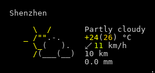

<h2 align="center">Hello there, I'm Shaun</h2>

Hi, I'm Shaun, a backend engineer from Shenzhen, China. Dedicated to being a fullstack engineer.
 
📫 How to reach me: <a href="mailto: dukenan006@163.com">dukenan006@163.com</a>

<h2 align="center">Languages & Frameworks & Tools & Abilities</h2>

  <code></code>
  <code></code>
  <code></code>
  <code></code>
  <code></code>
  <code></code>
  <code></code>
  <code></code>

  
  

<h2 align="center">Beautiful city</h2>

    
    
    

<h2 align="center">Weather</h2>

    

    Currently, the weather is: <b> Partly cloudy</b> 
    The current temperature is: <b> 27°C</b> 
    Maximum temperature and minimum temperature: <b>23°C ~ 29°C </b> 
    Today, the sun rises at <b>06:37 CST</b> and sets at <b>17:39 CST</b>.

    This <i>README</i> file is generated <b>every 3 hours</b>! 
    Last refresh: Thu Nov 17 11:43 CST  

